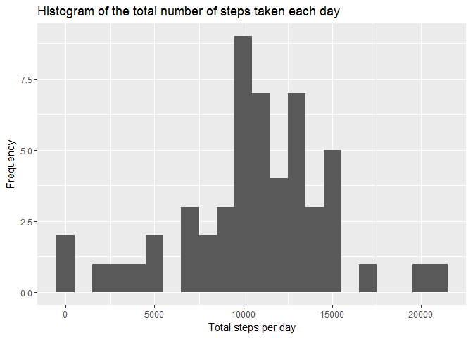
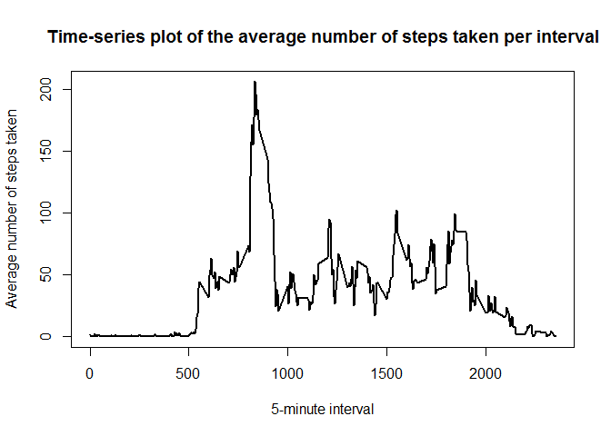
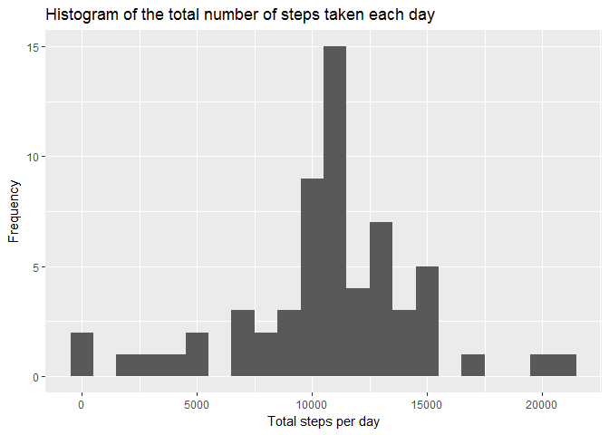
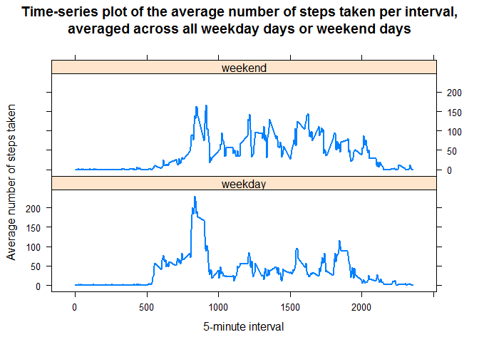

# Reproducible Research: Peer Assessment 1


## Loading and preprocessing the data

### 1. Load the data

```r
if(!file.exists("activity.csv")){
  unzip("activity.zip")
}
activity<- read.csv("activity.csv")
```

### 2. Process/transform the data (if necessary) into a format suitable for your analysis

We will convert the date field to Date class.


```r
activity$date<-as.Date(activity$date, format = "%Y-%m-%d")

## Let us look at the structure of the transformed data
str(activity)
```

```
## 'data.frame':	17568 obs. of  3 variables:
##  $ steps   : int  NA NA NA NA NA NA NA NA NA NA ...
##  $ date    : Date, format: "2012-10-01" "2012-10-01" ...
##  $ interval: int  0 5 10 15 20 25 30 35 40 45 ...
```


## What is mean total number of steps taken per day?

### 1. Calculate the total number of steps taken per day


```r
library(dplyr)
```

```r
## As per the instructions, we will ignore the missing values in the dataset
steps_day <- activity %>% na.omit()%>%group_by(date) %>% summarize_each(funs(sum),steps)

## Total steps taken per day
steps_day
```

```
## # A tibble: 53 × 2
##          date steps
##        <date> <int>
## 1  2012-10-02   126
## 2  2012-10-03 11352
## 3  2012-10-04 12116
## 4  2012-10-05 13294
## 5  2012-10-06 15420
## 6  2012-10-07 11015
## 7  2012-10-09 12811
## 8  2012-10-10  9900
## 9  2012-10-11 10304
## 10 2012-10-12 17382
## # ... with 43 more rows
```

### 2. Make a histogram of the total number of steps taken each day


```r
library(ggplot2)
qplot(steps_day$steps, xlab='Total steps per day', ylab='Frequency',main="Histogram of the total number of steps taken each day", binwidth=1000)
```

<!-- -->

### 3. Calculate and report the mean and median of the total number of steps taken per day


```r
mean_steps   <- round(mean(steps_day$steps),digits=2)
median_steps <- round(median(steps_day$steps),digits=2)
```

Below are the mean and median of the total number of steps taken per day-

* Mean: **10766.19**
* Median: **10765.00**

## What is the average daily activity pattern?

### 1. Make a time series plot (i.e. type = "l") of the 5-minute interval (x-axis) and the average number of steps taken, averaged across all days (y-axis)


```r
## Compute the average number of steps accross all days for each interval
avg_daily<-activity %>% group_by(interval) %>% summarise_each(funs(mean(.,na.rm=TRUE)),steps)

## Plot the time-series graph using the above data
plot(avg_daily$interval,avg_daily$steps, type="l", lwd=2, xlab="5-minute interval", ylab="Average number of steps taken", main="Time-series plot of the average number of steps taken per interval")
```

<!-- -->

### 2. Which 5-minute interval, on average across all the days in the dataset, contains the maximum number of steps?


```r
maxSteps <- which.max(avg_daily$steps)
maxSteps_TimeInterval <-  gsub("([0-9]{1,2})([0-9]{2})", "\\1:\\2", avg_daily[maxSteps,'interval'])
```

* The Interval **8:35** contains **206.17** steps, which is the maximum when averaged across all days.

## Imputing missing values
Note that there are a number of days/intervals where there are missing values (coded as NA). The presence of missing days may introduce bias into some calculations or summaries of the data.

### 1. Calculate and report the total number of missing values in the dataset (i.e. the total number of rows with NAs)


```r
NA_count<- sum(is.na(activity$steps))
```

Total number of missing values/NA's = **2304**

### 2. Devise a strategy for filling in all of the missing values in the dataset. The strategy does not need to be sophisticated. For example, you could use the mean/median for that day, or the mean for that 5-minute interval, etc.

To impute the missing/NA values of the number of steps for a given interval, we will use the mean for that 5-minute interval.

### 3. Create a new dataset that is equal to the original dataset but with the missing data filled in.


```r
## Merge activity data frame with avg_daily (which has the average number of steps accross all days for each interval) 
impute_activity<-activity%>% left_join(avg_daily,by='interval')

## Impute NA values with the mean values for corresponding 5-minute intervals
impute_activity$steps.x[is.na(impute_activity$steps.x)] <- impute_activity$steps.y[is.na(impute_activity$steps.x)]

## Format the new impute_activity data frame
impute_activity$steps=impute_activity$steps.x
impute_activity<-impute_activity[colnames(activity)]

## Let us look at the first few rows of impute_activity
head(impute_activity)
```

```
##   steps       date interval
## 1 1.717 2012-10-01        0
## 2 0.340 2012-10-01        5
## 3 0.132 2012-10-01       10
## 4 0.151 2012-10-01       15
## 5 0.075 2012-10-01       20
## 6 2.094 2012-10-01       25
```

```r
## We can verify that there are no NA values 
sum(is.na(impute_activity$steps))
```

```
## [1] 0
```

### 4. a) Make a histogram of the total number of steps taken each day and Calculate and report the mean and median total number of steps taken per day. 


```r
## Calculate the total number of steps taken per day
imputed_steps_day <- impute_activity %>% group_by(date) %>% summarize_each(funs(sum(.,na.rm=TRUE)),steps)

## Plot the required histogram
qplot(imputed_steps_day$steps, xlab='Total steps per day', ylab='Frequency',main="Histogram of the total number of steps taken each day", binwidth=1000)
```

<!-- -->

```r
## Calculate mean and median number of steps taken per day
mean_steps   <- round(mean(imputed_steps_day$steps),digits=2)
median_steps <- round(median(imputed_steps_day$steps),digits=2)
```

Below are the mean and median of the total number of steps taken per day, calculated after imputing the data-

* Mean: **10766.19**
* Median: **10766.19**

### 4. b) Do these values differ from the estimates from the first part of the assignment? What is the impact of imputing missing data on the estimates of the total daily number of steps?

* Yes, the median value has increased from **10765** to **10766.19** in comparison to the calculation done before imputing the missing values (in the first part of the assignment). But, the mean value is unchanged and is equal to **10766.19** for both the calculations.

* Since, we have replaced the NA step values with the mean for the corresponding 5-minute interval, there is practically no difference in the mean number of steps taken per day. Although, the new mean per day is averaged across 61 days whereas for the old mean, we had ommited the NA values and it was averaged across 53 days.But, since we have inserted the mean values for 5-minute intervals averaged across all the days in place of the NA values, the mean number of steps per day has essentially stayed the same.

* The median value has increased marginally and we can also observe that the distribution of the number of steps taken each day in the histogram with imputed data is more symmetric than the initial histogram.

## Are there differences in activity patterns between weekdays and weekends?

### 1. Create a new factor variable in the dataset with two levels - "weekday" and "weekend" indicating whether a given date is a weekday or weekend day.


```r
## Create a variable daytype to indicate whether a given day is a weekday or weekend day
impute_activity$daytype<-"weekday"
impute_activity$daytype[weekdays(impute_activity$date) %in% c("Saturday","Sunday")]<-"weekend"

## Convert daytype field to factor 
impute_activity$daytype <- as.factor(impute_activity$daytype)

## Check structure of the new data frame
str(impute_activity)
```

```
## 'data.frame':	17568 obs. of  4 variables:
##  $ steps   : num  1.717 0.3396 0.1321 0.1509 0.0755 ...
##  $ date    : Date, format: "2012-10-01" "2012-10-01" ...
##  $ interval: int  0 5 10 15 20 25 30 35 40 45 ...
##  $ daytype : Factor w/ 2 levels "weekday","weekend": 1 1 1 1 1 1 1 1 1 1 ...
```

### 2. Make a panel plot containing a time series plot (i.e. type = "l") of the 5-minute interval (x-axis) and the average number of steps taken, averaged across all weekday days or weekend days (y-axis). See the README file in the GitHub repository to see an example of what this plot should look like using simulated data.


```r
library(lattice)
```

```r
## Compute the average number of steps accross all days for each interval
new_avg_daily<-impute_activity %>% group_by(interval,daytype) %>% summarise_each(funs(mean(.,na.rm=TRUE)),steps)

## Plot the time-series graph using the above data
xyplot(steps~interval|daytype,new_avg_daily,type="l", lwd=2,layout=c(1,2), xlab="5-minute interval", ylab="Average number of steps taken", main="Time-series plot of the average number of steps taken per interval,\naveraged across all weekday days or weekend days")
```

<!-- -->
